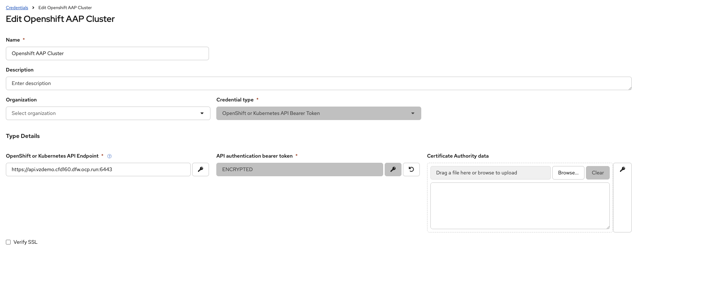
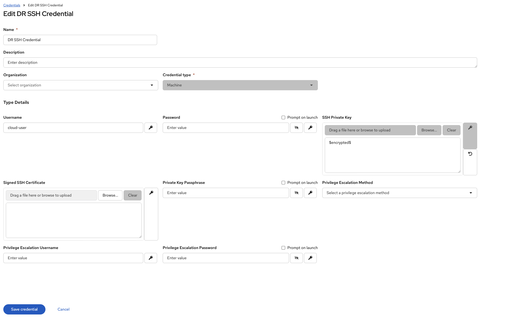
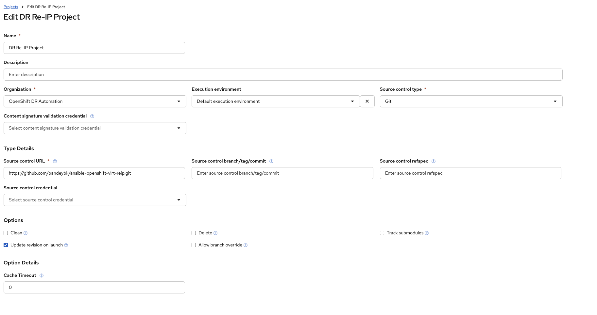
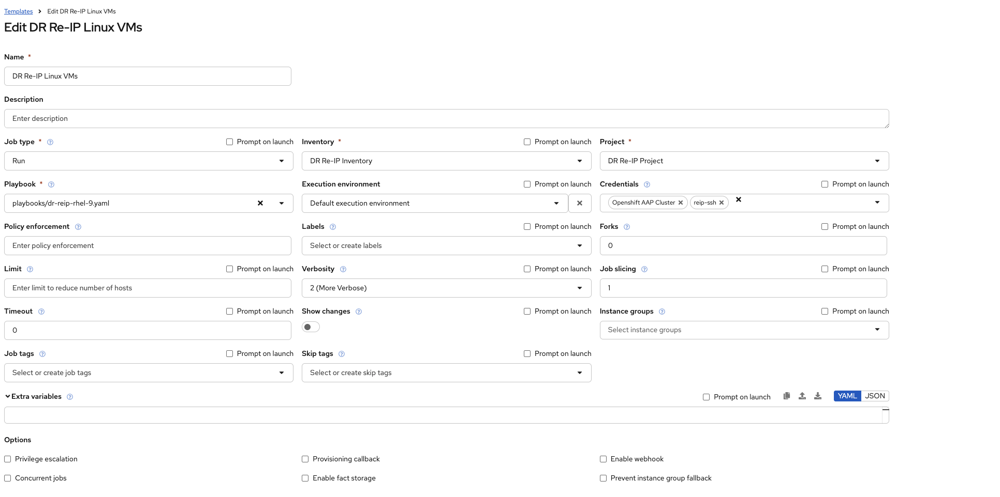
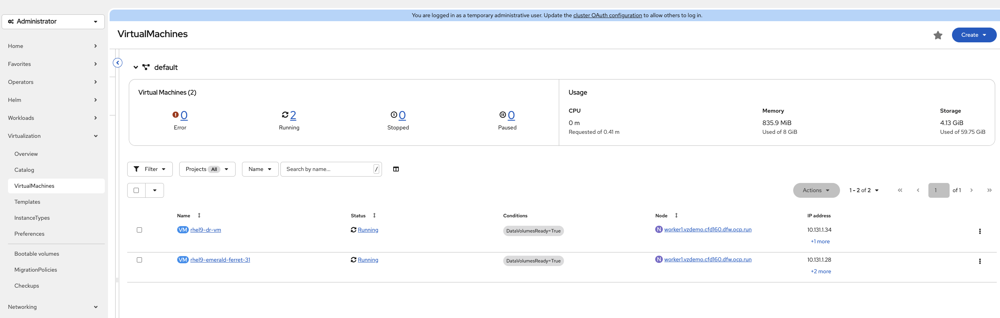
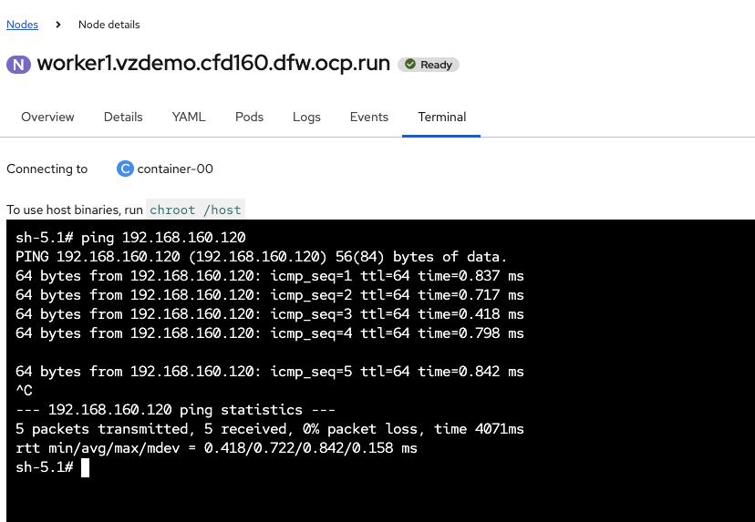
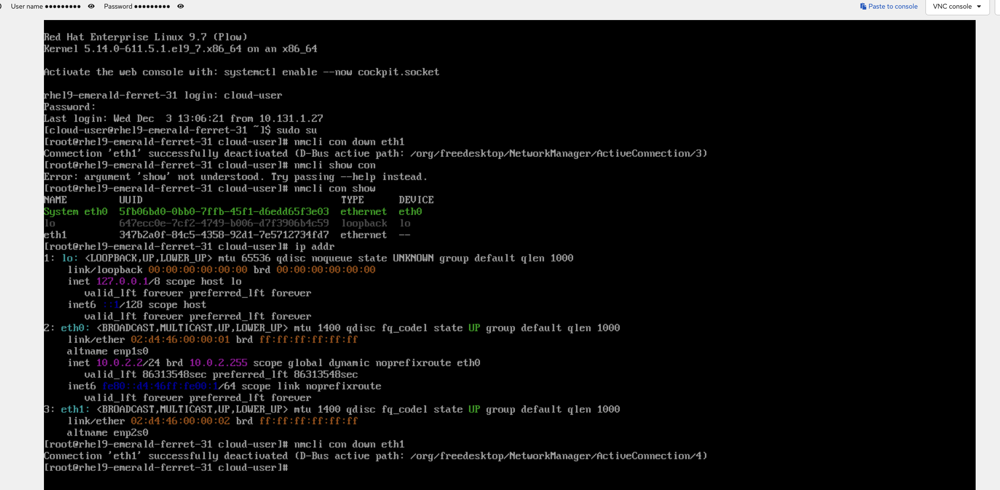
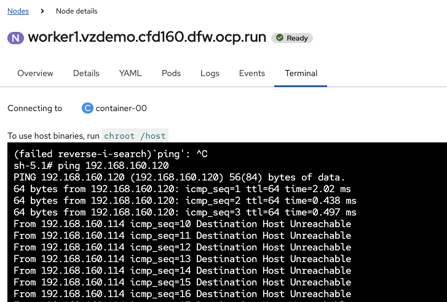
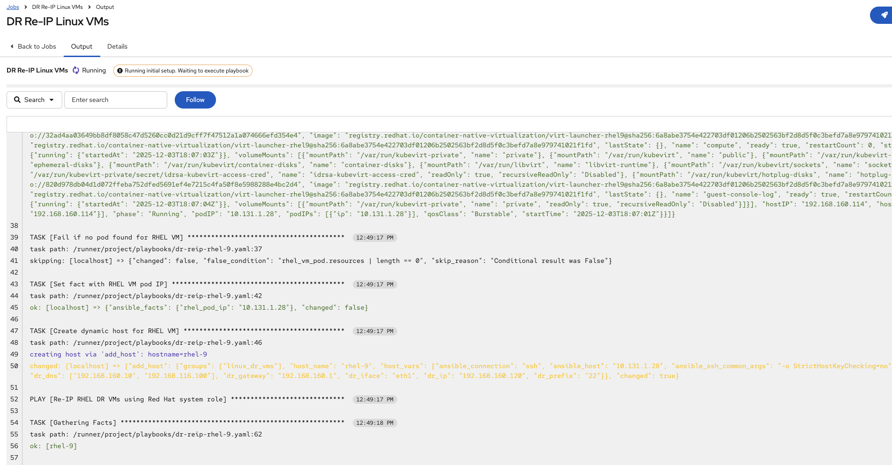
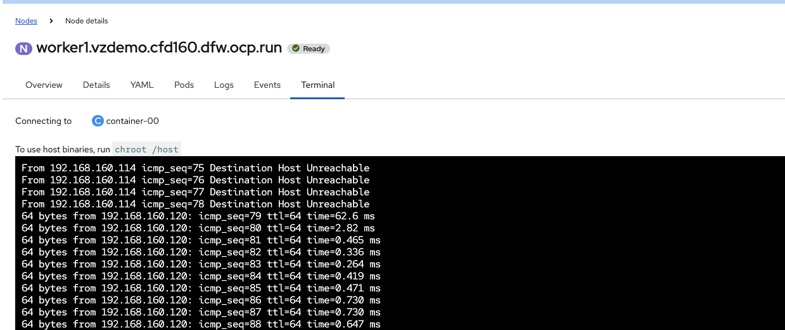

## Automated VM Re-IP on OpenShift Virtualization Using Multus + Ansible Automation Platform (AAP)

In real-world **disaster recovery (DR)** scenarios, virtual machines restored in a new location or restarted during failover may **lose their network configuration**—especially the static IP assigned to their **machine network** interface (e.g., `eth1` via Multus). Without this IP, the VM becomes unreachable on the application network and requires remediation.

During DR, we still need a reliable **management path** into the VM so we can repair the interface. In OpenShift Virtualization, the VM always receives a fresh **pod IP** on its primary (pod) network after reboot. This pod IP becomes a convenient transient management endpoint that Ansible can use to log in and restore the correct machine-network IP.

This project demonstrates how to fully automate this recovery process:

* Attach VMs to a **true machine-network** using **OVN LocalNet + Multus**
* Use the pod network only as a **temporary management plane** during DR
* Dynamically discover the VM’s new **pod IP** after reboot
* Build an on-the-fly **inventory entry** for Ansible
* Automatically reassign the VM’s **static IP** on `eth1` (machine network)
* Execute the entire workflow using **Ansible Automation Platform (AAP)**
* Demonstrate the full DR -> loss of IP -> automated recovery lifecycle


---

## 1. What We Are Trying To Achieve

The goal is to simulate DR for VMs in OpenShift Virtualization:

* VM restarts → pod IP changes (We are using this as managment IP)
* Static network on Multus interface (`eth1`) needs to be reconfigured (fixing this is the main goal)
* Ansible should automatically:

  * Discover the new pod IP
  * SSH into VM using that new address
  * Restore correct static IP on `eth1` (machine network)

Everything is automated through AAP and driven from GitHub.

Folder layout for reference:

```
ansible-openshift-virt-reip
├── openshift/
│   ├── localnet.yaml
│   └── virtual-machine-rhel9-dr.yaml
├── playbooks/
│   ├── dr-reip-rhel-9.yaml
│   └── dr-reip-windows.yaml
└── inventory/
    ├── group_vars/
    └── host_vars/
```

---

## 2. Attaching VMs to the Machine Network Using Multus LocalNet

To simulate a **real bare-metal-like network**, we configure:

* A **NodeNetworkConfigurationPolicy**
* A **Multus NetworkAttachmentDefinition**
* A VM attached via a Multus interface (`eth1`)

---

## 2.1 Node Network Configuration: Bridge + LocalNet Binding

This creates an OVN bridge mapping to expose the node's external interface inside OVN as a *localnet*.

```yaml
apiVersion: nmstate.io/v1
kind: NodeNetworkConfigurationPolicy
metadata:
  name: ovs-br-ex-bridge
spec:
  desiredState:
    ovn:
      bridge-mappings:
        - bridge: br-ex
          localnet: machine-network
          state: present
  nodeSelector:
    kubernetes.io/hostname: worker1.vzdemo.cfd160.dfw.ocp.run
```

* Maps `br-ex` to a localnet name: `machine-network`
* Allows VMs to join the real L2 network on that node
* No VXLAN/overlay — true L2

---

## 2.2 Multus NetworkAttachmentDefinition Using OVN LocalNet

```yaml
apiVersion: k8s.cni.cncf.io/v1
kind: NetworkAttachmentDefinition
metadata:
  annotations:
    description: baremetal-network connection for VMs
  name: machine-network
  namespace: default
spec:
  config: |-
    {
      "cniVersion": "0.3.1", 
      "name": "machine-network", 
      "type": "ovn-k8s-cni-overlay", 
      "topology": "localnet", 
      "promiscMode": true,
      "netAttachDefName": "default/machine-network",
      "ipam": {}
    }
```

Key details:

* **`type: ovn-k8s-cni-overlay`** with **`topology: localnet`** → attaches to real node L2
* `ipam: {}` → VM NIC gets no IP; VM config decides IP (good for DR)
* This interface will appear inside VM as **eth1**

---

## 2.3 VM Template with Multus Machine-Network Interface

This VM template attaches:

* `eth0` → Pod network
* `eth1` → Machine network (localnet)

```yaml
apiVersion: kubevirt.io/v1
kind: VirtualMachine
metadata:
  name: rhel9-dr-vm
  namespace: default
  labels:
    kubevirt.io/domain: rhel9-dr-vm
spec:
  runStrategy: RerunOnFailure
  template:
    spec:
      domain:
        devices:
          interfaces:
            - name: default
              masquerade: {}
            - name: eth1
              bridge: {}
              state: up
              macAddress: '02:d4:48:00:00:02'
      networks:
        - name: default
          pod: {}
        - name: eth1
          multus:
            networkName: machine-network
      volumes:
        - cloudInitNoCloud:
            userData: |-
              #cloud-config
              user: cloud-user
              password: fiki-xrk5-xsbg
              chpasswd: { expire: False }
```

Inside the VM, the interfaces look like:

* `eth0` → DHCP pod IP (changes every reboot)
* `eth1` → No IP initially (we assign static IP via Ansible)

---

## 3. Dynamic Pod IP Lookup using Ansible Playbook

When VM restarts → pod recreated → pod IP changes.

Our playbook dynamically discovers the VM pod using:

```yaml
kubernetes.core.k8s_info
```

Then creates a temporary host entry with:

```yaml
ansible.builtin.add_host
```

This means:

* No static IP in inventory
* AAP builds inventory at runtime
* 100% compatible with OpenShift Virtualization

---

### 3.1 Required AAP Credential

To setup credentials Go To:
```
Automation Executation -> Infrastructure -> Credentials -> Create Credential
```

3.1.1 Create a **Kubernetes/OpenShift API Credential**:

* Host:

  ```
  https://api.<cluster>:6443
  ```
* Token:

  ```
  oc whoami -t
  ```
* CA cert: cluster CA

This credential gives playbook permission to run `k8s_info`.




3.1.2 Create a **SSH Credentials**:

 * Name: `DR SSH Credential`
 * Credential Type: `Machine`
 * Username: `cloud-user`
 * SSH Private Key : `get-the-ssh-privatekey` you can use `ssh-keygen` to generate new. Make sure public key is inserted in `VirtualMachine` above.



---

## 4. Anatomy of the DR Re-IP Playbook

The key playbook is:

```
playbooks/dr-reip-rhel-9.yaml
```

The playbook has 2 parts:

---

### **Play 1 — Discover VM Pod + Create Dynamic Host**

* No `become` (runs on localhost)
* Loads group_vars + host_vars
* Queries Kubernetes for VM pod (via label)
* Extracts pod IP
* Creates Ansible host `rhel-9` dynamically with:

  * ansible_host = podIP
  * dr_ip, dr_prefix, dr_gateway, dr_dns

---

### **Play 2 — Apply RHEL System Role to eth1**

* Uses `redhat.rhel_system_roles.network`
* Ensures:

  * `eth1` has DR static IP
  * Routes + DNS restored


---

## 5. Setting Up AAP (Organization, Project, Job Template)

## 5.1 Create Organization

Go to:

```
Access Management -> Organizations -> Add
```

Name: `OpenShift DR Automation`

---

## 5.2 Create Project from GitHub

Go to:
```
Automation Execution -> Projects -> Create Project
```
Name: `DR Re-IP Project`

* **GIT URL:**

  ```
  https://github.com/pandeybk/ansible-openshift-virt-reip.git
  ```
* **GIT Branch:** `main`
* Enable: **Update Revision on Launch**



---

## 5.3 Create Job Template

Go to:
```
Automation Execution -> Templates -> Create Template
```

* Name: `DR Re-IP Linux VMs`
* Inventory: Create 
* Project: *DR Re-IP Project*
* Playbook:

  ```
  playbooks/dr-reip-rhel-9.yaml
  ```
* Credentials:

  * **Kubernetes/OpenShift API**
  * **Linux Machine SSH**



---

## 6. Demo Part 1 — Validate VM Connectivity

### Step 1: Open OpenShift Virtualization console



### Step 2: From a Jumpbox or linux VM, ping VM’s machine-network IP

```
ping 192.168.160.120
```

Expected: replies OK.



---

## 7. Demo Part 2 — Break the Network (Simulated DR Event)

Open Web Console -> Login

```
nmcli con down eth1
```


### Expected:

* Ping drops
* Machine network unreachable



---

## 8. Demo Part 3 — Run Ansible Automation Platform Job

1. Go to AAP Templates
2. Launch **DR Re-IP Linux VMs**
3. Watch logs:

   * Discover pod
   * Create dynamic host
   * Connect via SSH
   * Apply RHEL System Role
   * Restore eth1



---

## 9. Demo Part 4 — Verify Recovery

Re-run:

```
ping 192.168.160.120
```

Expected: ping restores immediately → VM is back on the machine network.


